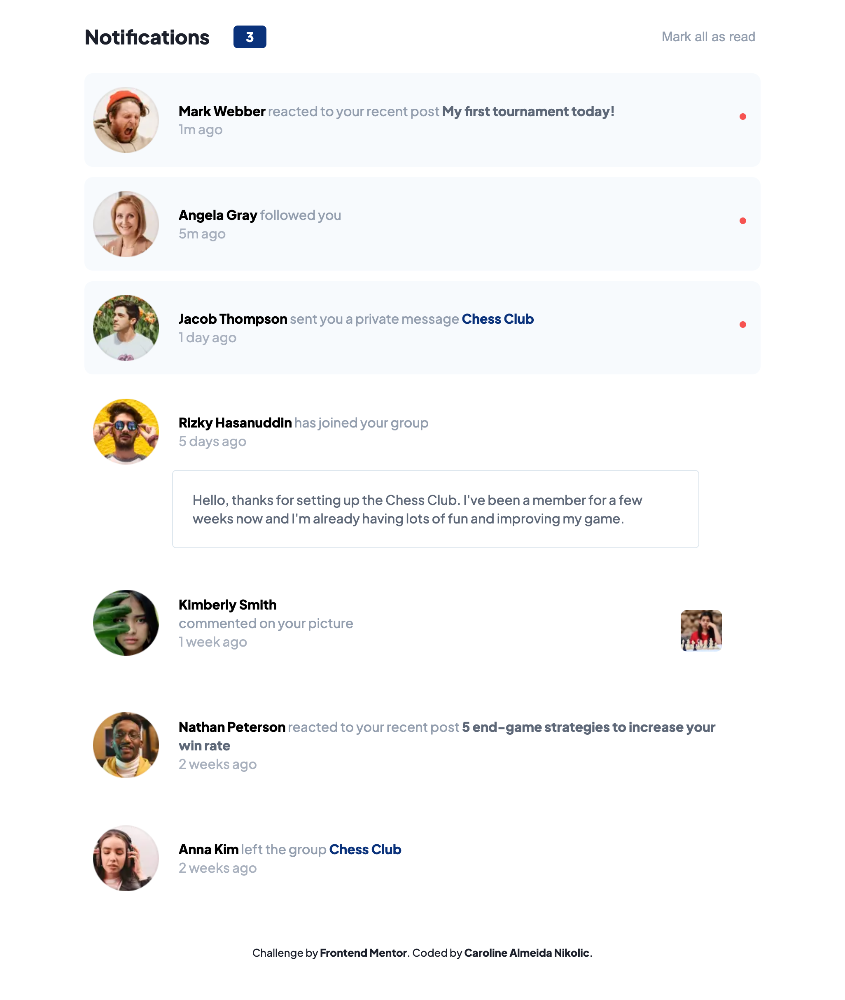
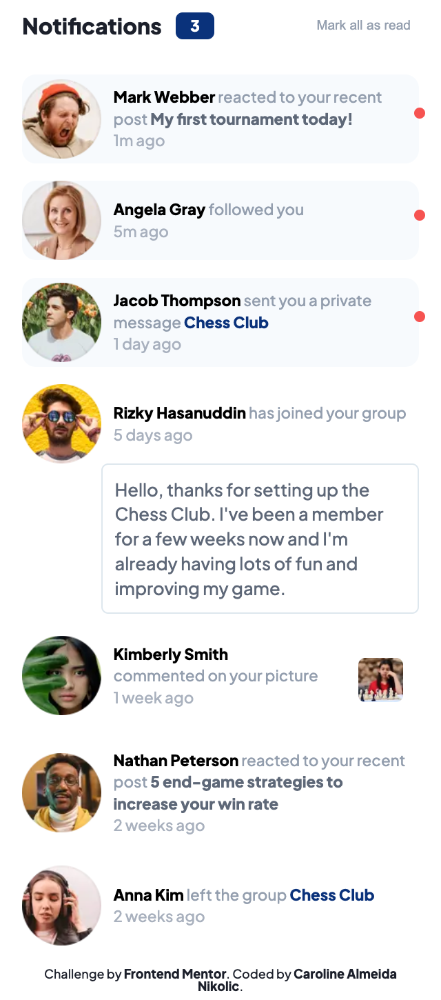

# Notifications Page 

Notifications page is a project from Frontend Mentor. It displays the notifications and allows you to change their status from unread to read. As you do it you will see the changing on the visual state of the notifications. The purpose of this project is to test my abilities in HTML, CSS and JS.

## Technologies used :hammer_and_wrench:
- [HTML5](https://html.com)
- [CSS3](https://www.w3.org/Style/CSS/Overview.en.html)
- [JavaScript](https://www.javascript.com)

## Requirements :computer:

To work with the code, you will need, before you begin, to install in your machine Git. Also, it's a good idea to have a source-code editor like [VSCode](https://code.visualstudio.com/).

## Main Learnings :nerd_face:
> Mobile-first (media query) 
> Access and manipulate properties of pseudo elements with JS

----

#### Check it out:  notifications-project.netlify.app
#### Project based on challenge from [Frontend Mentor](https://www.frontendmentor.io/challenges/notifications-page-DqK5QAmKbC).

⌨️ with ❤️ by [Caroline Almeida Nikolic](https://www.linkedin.com/in/carolinealmeidanikolic/) 😊
